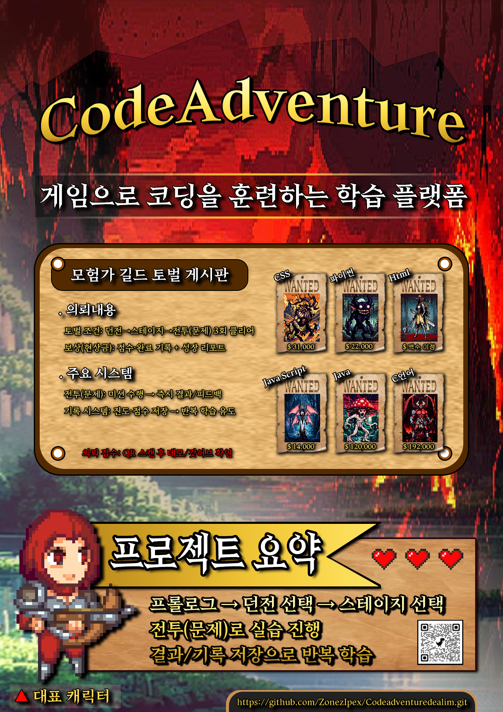

<p align="center">
  
</p>

<p align="center">
  
  
  
  
</p>

---

# CodeAdventure Daelim
여러 언어(C / Java / JavaScript / HTML / CSS)를 **스테이지 기반 퀴즈(전투)**로 학습하는 웹 프로젝트입니다.  
로그인 → 언어 선택 → 스테이지 진행 → 정답 제출 → 보상(코인/경험치) → 상점/힌트 구매 흐름으로 구성했습니다.

---

## 0. 바로가기
- 서비스 도메인(CORS 기준): `https://www.codeadventure.shop`
- 발표자료(PDF): `./코드어드밴쳐.pdf`
- 포스터(PNG): `./코드어드벤처포스터.png`
- 서버 엔트리: `server.js`
- Netlify 설정: `netlify.toml`

---

## 1. 포스터 / 한눈에 보기

<table>
  <tr>
    <td width="58%" align="center">
      
      <br />
      <sub><b>길드 게시판(현상금/토벌) 컨셉으로 '학습 = 퀘스트' 경험을 시각화</b></sub>
    </td>
    <td width="42%">
      <h3>프로젝트 요약</h3>
      <ul>
        <li><b>목표</b>: 코딩 문제 풀이를 게임 진행(스테이지/보상)으로 전환해 반복 학습 유도</li>
        <li><b>사용자 플로우</b>: 로그인 → 언어 선택 → 스테이지 → 퀴즈 → 보상 → 상점/힌트</li>
        <li><b>핵심 데이터</b>: 진행도(언어별), 코인/경험치/레벨, 구매/재고 로그</li>
        <li><b>문서</b>: 화면 캡처/소개는 PDF에 포함</li>
      </ul>
      <hr />
      <h3>현재 레포 상태(중요)</h3>
      <ul>
        <li><b>server.js</b>에서 <code>./lib/sessionOption</code>을 require 하지만 <b>lib 폴더가 레포에 없음</b></li>
        <li><b>db 연결(require("./lib/db"))</b>이 주석 처리되어 있지만 코드에서는 <code>db.query</code>를 사용함 → <b>그대로 실행 시 오류</b></li>
        <li>CRA 프론트 기준으로 보통 존재하는 <b>src/public</b> 폴더가 레포에 없음</li>
        <li>서버는 <b>build/</b> 정적 서빙을 전제로 하지만 <b>build 폴더가 레포에 없음</b></li>
      </ul>
      <p>
        이 README는 위 레포 상태를 반영해, <b>"소개/검증 가능한 내용"</b> 중심으로 정리했습니다.
      </p>
    </td>
  </tr>
</table>

---

## 2. 핵심 컨셉
- 학습을 “퀘스트”로 변환
  - 문제 = 전투(스테이지)
  - 결과 = 보상(코인/경험치) + 진행도 저장
- 반복 학습 유도
  - 진행도/보상 누적으로 성취감 강화
- 최소 진입 장벽
  - 로그인 후 언어/스테이지 선택만으로 즉시 학습 시작

---

## 3. 사용자 흐름(기능 기준)
- 회원가입/로그인
- 언어 선택
- 스테이지 목록 확인
- 스테이지 퀴즈 진행(정답 제출)
- 진행도 업데이트 + 보상 지급(코인/경험치)
- 상점에서 아이템/힌트 구매(재고/관리 기능 포함)

---

## 4. 시스템 구조

```mermaid
flowchart TB
  U[User] --> FE[Frontend (React/CRA)]
  FE -->|REST + credentials| BE[Backend (Node/Express)]
  BE --> DB[(MySQL)]
  BE --> SS[(MySQL Session Store)]

  subgraph Domain
    BE --> A[Auth/Session]
    BE --> Q[Stage/Quiz]
    BE --> S[Shop/Hint]
    BE --> M[Manager/Admin]
  end
```

- 서버 포트: `3001` (server.js 기준)
- CORS: `origin: "https://www.codeadventure.shop", credentials: true` (server.js 기준)

---

## 5. 주요 기능 요약(서버 라우트 기준)

<table>
  <tr>
    <th width="18%">구분</th>
    <th width="52%">설명</th>
    <th width="30%">관련 API</th>
  </tr>
  <tr>
    <td>계정/세션</td>
    <td>세션 기반 로그인 유지, 로그인 상태 확인, 로그아웃</td>
    <td><code>POST /login</code>, <code>GET /authcheck</code>, <code>GET /logout</code></td>
  </tr>
  <tr>
    <td>회원가입</td>
    <td>중복 사용자 검사 후 bcrypt 해시 저장</td>
    <td><code>POST /signin</code></td>
  </tr>
  <tr>
    <td>스테이지/퀴즈</td>
    <td>언어별 스테이지 조회, 스테이지별 퀴즈 조회, 정답 제출 및 진행도 갱신</td>
    <td><code>GET /stages</code>, <code>GET /quiz/:stageId</code>, <code>POST /submit-answer</code></td>
  </tr>
  <tr>
    <td>유저 정보</td>
    <td>코인/경험치/레벨, 언어별 진행도 포함</td>
    <td><code>GET /userinfo</code></td>
  </tr>
  <tr>
    <td>상점/힌트</td>
    <td>상품 목록/구매, 재고 변경, 힌트 구매, 구매 로그</td>
    <td><code>GET /shop</code>, <code>POST /purchase</code>, <code>POST /update-quantity/:productId</code>, <code>POST /purchase-hint</code>, <code>GET /purchase-log</code></td>
  </tr>
  <tr>
    <td>관리자</td>
    <td>관리자 권한 확인(세션 기준)</td>
    <td><code>GET /managercheck</code></td>
  </tr>
</table>

---

## 6. API 목록(요약)
`server.js`에 정의된 라우트 기준입니다.

### Base
- GET `/` (build가 존재할 경우 `build/index.html` 서빙)

### Auth / User
- GET  `/authcheck`
- GET  `/users`
- GET  `/userinfo`
- POST `/signin`
- POST `/login`
- GET  `/logout`

### Stage / Quiz
- GET  `/check-language-start`
- GET  `/stages?language={c|java|js|html|css}`
- GET  `/quiz/:stageId?language={...}`
- POST `/submit-answer`

### Shop / Admin
- GET  `/managercheck`
- GET  `/purchase-log`
- GET  `/shop`
- POST `/purchase`
- POST `/update-quantity/:productId`
- POST `/purchase-hint`

---

## 7. 레포 구조(현재 업로드 기준)

```txt
/
  .gitignore
  README.md
  netlify.toml
  package.json
  package-lock.json
  server.js
  코드어드밴쳐.pdf
  코드어드벤처포스터.png
```

---

## 8. 실행 방법(현재 레포 기준: 그대로는 실패 가능)
현재 레포는 실행에 필요한 일부 파일/폴더가 누락된 상태입니다.  
실행을 목표로 한다면 아래 체크를 먼저 통과해야 합니다.

### 8.1 필수 체크(실행 실패 원인)
- `server.js`에서 사용하는 `db`가 정의되지 않음
  - `const db = require("./lib/db");` 주석 상태
  - 코드 내 `db.query(...)` 다수 존재
- `./lib/sessionOption` 파일이 레포에 없음
- 프론트 소스(`src/`, `public/`) 및 빌드 산출물(`build/`)이 레포에 없음

### 8.2 (선택) 서버 최소 구동용 템플릿
아래는 레포에 없는 `lib/`를 만든다는 가정의 최소 템플릿입니다.  
실제 계정/DB명은 본인 환경에 맞게 수정하세요.

#### lib/sessionOption.js
```js
// lib/sessionOption.js
module.exports = {
  host: "localhost",
  port: 3306,
  user: "root",
  password: "password",
  database: "codeadventure",
};
```

#### lib/db.js
```js
// lib/db.js
const mysql = require("mysql2");

const db = mysql.createPool({
  host: "localhost",
  port: 3306,
  user: "root",
  password: "password",
  database: "codeadventure",
  connectionLimit: 10,
});

module.exports = db;
```

그리고 `server.js`의 주석을 해제해야 합니다.
```js
// server.js
const db = require("./lib/db"); // 주석 해제 필요
```

### 8.3 실행(프론트 소스가 존재한다는 전제)
```bash
npm install
node server.js
```

---

## 9. 배포
### 9.1 Netlify(프론트)
현재 `netlify.toml`은 들여쓰기 때문에 파싱 이슈가 날 수 있습니다. 아래처럼 정렬을 권장합니다.

```toml
[build]
  base = ""
  command = "CI=false npm run build"
  publish = "build"
```

### 9.2 서버(API)
- `server.js`는 CORS origin이 `https://www.codeadventure.shop`로 고정입니다.
- 로컬/운영을 병행하려면 환경변수로 분리하는 방식이 안전합니다.

---

## 10. 문서(발표자료)
- 발표자료(PDF): `./코드어드밴쳐.pdf`
  - 프로젝트 개요/목표
  - 화면 캡처(시작/회원/로그인/언어선택/스테이지/퀴즈)
  - 개선 포인트 정리

<details>
<summary><b>문서 활용 팁</b></summary>

- README에서 화면을 더 “이미지 위주”로 보이게 하려면
  1) PDF에서 주요 화면을 이미지로 추출  
  2) <code>/img</code> 폴더로 정리  
  3) README에 갤러리 섹션(썸네일 테이블) 추가  
  순서가 가장 깔끔합니다.

</details>

---

## 11. 유지보수/감점 포인트(현재 코드 기준)
- 실행 가능한 형태로 공개할 경우, 아래는 우선순위가 높습니다.
  - `db` 미정의 문제 해결(주석 해제 + lib/db 제공)
  - `lib/sessionOption` 누락 보완
  - CORS origin 고정 → 로컬 개발 시 차단 가능(환경변수 분리)
  - `secret: "~"` 고정값 → 운영 환경에서는 교체 권장
  - 프론트 소스/빌드 산출물 포함 여부를 README에 명시(현재는 누락)

---
